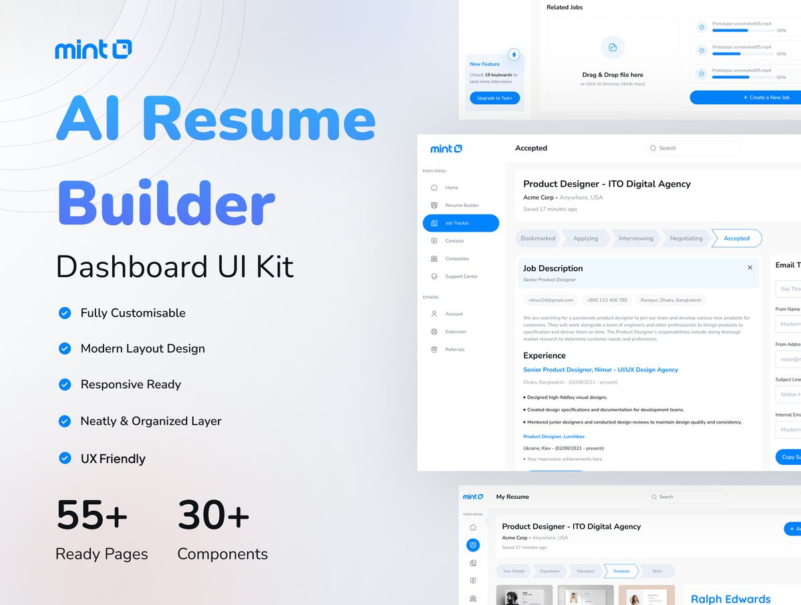
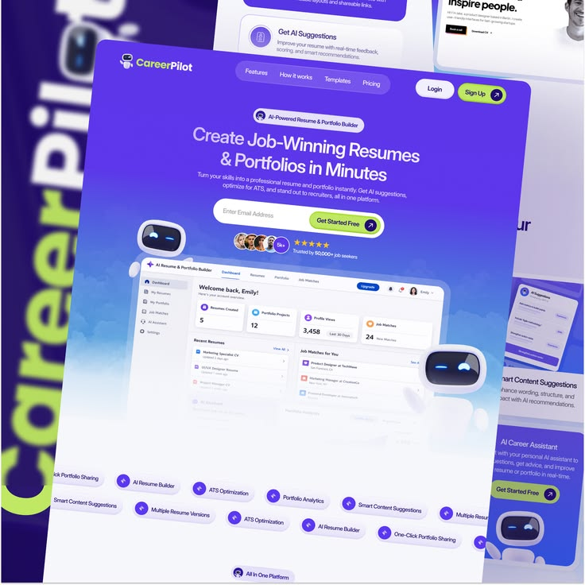
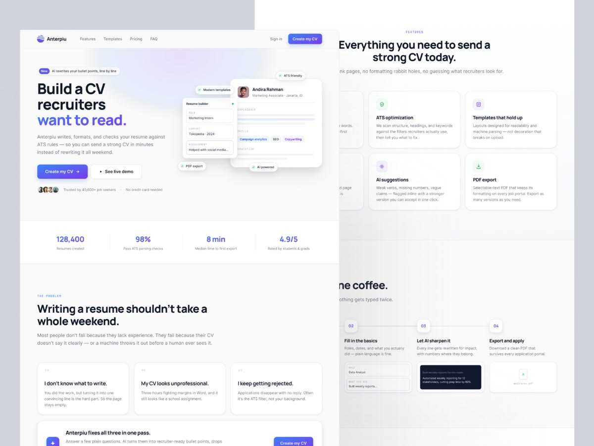
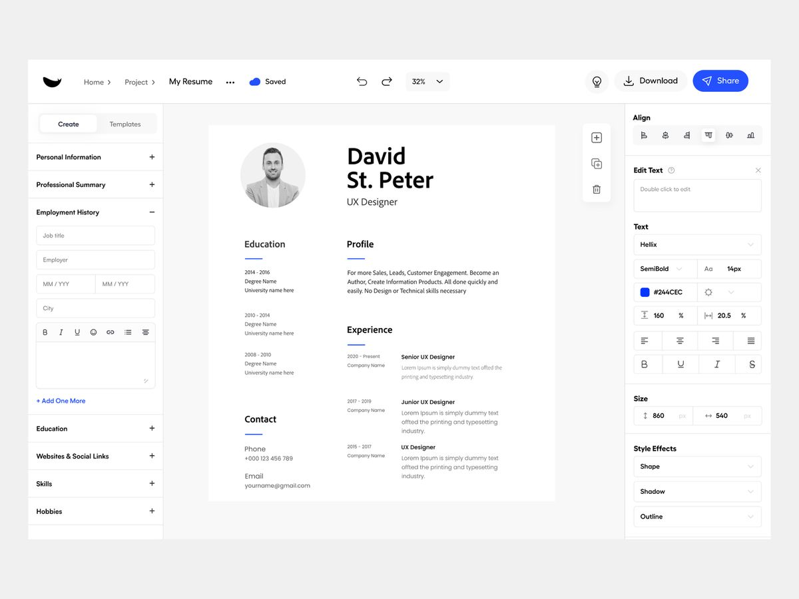
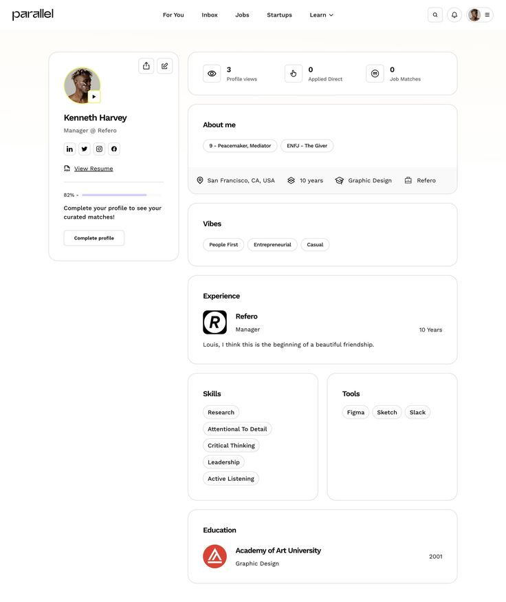

# CareerPilot AI — Developer Guide
### UI Architecture, Component Handling & Code Maintainability

> **Purpose:** This document is the single source of truth for any developer working on CareerPilot AI. It covers the project folder structure, every module's responsibility, the full UI component catalog (with parameters), the styling/design-token system, the application page flow, state management patterns, and the design inspiration language to follow. **No code changes should be made without reading this document first.**

---

## Table of Contents

1. [Project Folder Structure](#1-project-folder-structure)
2. [Module Architecture & Responsibility Map](#2-module-architecture--responsibility-map)
3. [UI Component Catalog (Full API Reference)](#3-ui-component-catalog-full-api-reference)
4. [Styling & Design Token System](#4-styling--design-token-system)
5. [Application Page Flow & Router](#5-application-page-flow--router)
6. [State Management](#6-state-management)
7. [Design Inspiration & Visual Language](#7-design-inspiration--visual-language)
8. [Code Maintainability Rules](#8-code-maintainability-rules)
9. [Adding a New Feature — Checklist](#9-adding-a-new-feature--checklist)

---

## 1. Project Folder Structure

```
CareerPilot_AI/
├── .env                        # Local API keys (GEMINI_API_KEY, GEMINI_MODEL)
├── .env.example                # Template for .env
├── .gitignore
├── .streamlit/
│   └── config.toml             # Streamlit theme (primaryColor, font, etc.)
├── app.py                      # ★ MAIN ENTRY POINT — page router + all page_*() functions
├── assets/
│   └── style.css               # ★ GLOBAL DESIGN SYSTEM — tokens, overrides, component classes
├── design_inps/                # Design inspiration images (6 reference screenshots)
│   ├── 157f01a9...jpg          # Mint Resume Builder — dashboard UI kit
│   ├── 2d39908d...jpg          # CareerPilot landing — purple gradient, feature badges
│   ├── 42bf261c...jpg          # Anterpiu — clean CV builder, stat counters, feature grid
│   ├── 6c1522cb...jpg          # LinkedIn profile audit — before/after cards
│   ├── b473b312...jpg          # Resume editor — sidebar form + live preview + toolbar
│   └── f997605a...jpg          # Parallel profile — card-based skills/experience layout
├── docs/
│   ├── commandbase.md          # (placeholder)
│   └── ui_architecture_plan.md # THIS FILE
├── modules/
│   ├── __init__.py             # Empty — makes modules/ a Python package
│   ├── career_readiness.py     # 7-day learning plan, mini-project, progress tracking
│   ├── career_tools.py         # Outreach email, learning roadmap, bullet rewrites, PDF/DOCX gen
│   ├── gemini_client.py        # ★ AI GATEWAY — all Gemini API calls go through here
│   ├── interview.py            # Placement test generation + evaluation, mock interview
│   ├── jd_input.py             # JD URL scraping, sample JD generation, company context
│   ├── job_recommender.py      # Job recommendations + apply-link builder
│   ├── matcher.py              # Semantic + keyword matching → composite score
│   ├── resume_parser.py        # PDF/DOCX text extraction, skill extraction (spaCy)
│   └── ui_components.py        # ★ ALL REUSABLE UI COMPONENTS — HTML generators
├── refactor.py                 # One-off regex refactoring script (not runtime)
├── requirements.txt            # Python dependencies
├── sample_data/                # Test fixtures for manual QA
│   ├── sample_job_description.txt
│   ├── sample_resume.pdf
│   └── sample_resume.txt
└── venv/                       # Virtual environment (not committed)
```

### Key Architectural Boundaries

| Layer | Files | Rule |
|---|---|---|
| **Entry point / Router** | `app.py` | Orchestrates pages. Calls module functions. **Never** contains business logic or raw HTML generation. |
| **UI Components** | `modules/ui_components.py` | Generates all reusable HTML. Every new visual pattern gets a function here. |
| **Design System** | `assets/style.css` | CSS custom properties (tokens), Streamlit overrides, `cp-*` component classes. All visual rules live here. |
| **AI Gateway** | `modules/gemini_client.py` | **Only** file that imports `google.genai`. All AI calls go through `generate_text()` or `generate_json()`. |
| **Business Logic** | All other `modules/*.py` | Domain logic (parsing, matching, recommendations). **Never** calls `st.markdown()` or renders UI. |
| **Configuration** | `.streamlit/config.toml`, `.env` | Theme tokens and API keys. |

---

## 2. Module Architecture & Responsibility Map

```
┌──────────────────────────────────────────────────────────────────┐
│                          app.py                                  │
│  • Initializes session state                                     │
│  • Loads CSS + Tailwind                                          │
│  • Defines page_*() functions (one per route)                    │
│  • Sidebar navigation + PAGES router dict                        │
│  • goto() / reset_all() helpers                                  │
└──────────────┬───────────────────────────────────────────────────┘
               │  imports
    ┌──────────┼──────────────────────────────────────┐
    ▼          ▼                                      ▼
┌──────────┐ ┌────────────────┐              ┌──────────────────┐
│ui_comp.py│ │ resume_parser  │              │  gemini_client   │
│          │ │                │              │                  │
│ render_* │ │ extract_text() │              │ generate_text()  │
│ card_*   │ │ extract_skills │              │ generate_json()  │
│ badge_*  │ │ extract_layout │              └────────┬─────────┘
│ score_*  │ └────────────────┘                       │
│ etc.     │                                          │ used by
└──────────┘         ┌────────────────────────────────┼────────────┐
                     ▼            ▼           ▼       ▼            ▼
              ┌──────────┐ ┌──────────┐ ┌──────────┐ ┌──────────────┐
              │ matcher  │ │interview │ │jd_input  │ │career_tools  │
              │          │ │          │ │          │ │              │
              │compute_  │ │generate_ │ │extract_  │ │generate_     │
              │match()   │ │interview │ │jd_from_  │ │outreach_     │
              └──────────┘ │evaluate_ │ │url()     │ │email()       │
                           │answers() │ └──────────┘ │build_resume_ │
                           └──────────┘              │pdf/docx()    │
              ┌──────────────┐  ┌──────────────────┐ └──────────────┘
              │job_recommender│ │career_readiness   │
              │              │ │                    │
              │recommend_    │ │generate_7day_plan()│
              │jobs()        │ │generate_ai_mini_   │
              └──────────────┘ │project()           │
                               └────────────────────┘
```

### Module-by-Module Reference

#### `gemini_client.py` — AI Gateway
- **`generate_text(prompt, temperature=0.4) → str`** — Raw text response from Gemini.
- **`generate_json(prompt, temperature=0.3) → dict|list`** — Parsed JSON response with markdown-fence stripping.
- Uses `_get_client()` singleton, `_get_api_key()` (secrets → env fallback), `_get_model_name()`.
- **Rule:** No other module should import `google.genai` directly.

#### `resume_parser.py` — Document Processing
- **`extract_text_from_pdf(file) → str`** — PyMuPDF text extraction.
- **`extract_text_from_docx(file_bytes) → str`** — python-docx extraction (paragraphs + table cells).
- **`extract_layout_lines(file_bytes) → list[dict]`** — Line-by-line layout data for design-preserving edits.
- **`extract_skills(text) → list[str]`** — Matches against `SKILLS_VOCAB` using spaCy + regex.
- spaCy model is cached with `@st.cache_resource`.

#### `matcher.py` — Score Engine
- **`compute_match(resume, jd) → dict`** — Blends semantic similarity (60%) + skill overlap (40%).
- Returns `match_score`, `matched_pct`, `missing_pct`, `matched_skills`, `missing_skills`, `extra_skills`.
- Embedding model (`all-MiniLM-L6-v2`) cached with `@st.cache_resource`.

#### `interview.py` — Assessment Engine
- **`generate_interview(resume, jd, requires_coding, company_context) → dict`** — Generates MCQs (aptitude/verbal/reasoning) + technical + coding.
- **`evaluate_answers(resume, jd, interview, answers) → dict`** — Scores with category breakdown.
- **`generate_mock_interview_questions(resume, jd) → list[str]`** — 3–5 spoken-style questions.
- **`evaluate_mock_interview(resume, jd, questions, answers) → dict`** — Communication/technical/confidence scores.

#### `jd_input.py` — Job Description Acquisition
- **`extract_jd_from_url(url) → str`** — BeautifulSoup scrape (best-effort, fallback to paste).
- **`generate_sample_jd(title) → str`** — Gemini-generated realistic JD.
- **`fetch_company_context(url) → str`** — About/Careers page text for RAG.

#### `job_recommender.py` — Job Matching
- **`recommend_jobs(resume, skills, score) → list[dict]`** — 2–3 alternative roles with apply links.
- **`ELIGIBILITY_THRESHOLD = 75`** — The global score gate for interview access.
- Builds search URLs for LinkedIn, Indeed, Naukri, Internshala, Google Jobs.

#### `career_tools.py` — Toolkit Features
- **`generate_outreach_email(resume, jd) → str`** — Professional email draft.
- **`generate_learning_roadmap(missing_skills, jd) → str`** — Week-by-week plan.
- **`generate_resume_debate(resume, jd) → dict`** — Shortlist vs. rejection reasons.
- **`generate_bullet_rewrites(resume, missing_skills, jd) → list[dict]`** — Rewritten bullet points.
- **`generate_tailored_resume(resume, jd, matched, missing) → str`** — Full rewritten resume text.
- **`generate_layout_constrained_rewrites(...) → list`** — Line-level edits preserving layout.
- **`apply_layout_preserving_edits(pdf_bytes, lines, rewrites) → bytes`** — White-out and re-insert text in PDF.
- **`build_resume_pdf(text) → bytes`**, **`build_resume_docx(text) → bytes`** — Export formats.
- **`build_resume_diff_html(original, optimized) → str`**, **`build_section_diffs(...) → list`** — Diff rendering.
- **`build_report_markdown(session_state) → str`** — Downloadable career report (no AI call).

#### `career_readiness.py` — Decision Engine
- **`generate_7day_learning_plan(resume, jd, missing_skills) → str`** — Daily learning plan.
- **`generate_ai_mini_project(resume, jd, missing_skills) → dict`** — Portfolio project recommendation.
- **`generate_improvement_summary(prev_score, new_score, prev_skills, curr_skills, missing) → str`**
- **`recommend_skill_based_jobs(resume, skills) → list[dict]`** — Jobs based on current skills (not target JD).

---

## 3. UI Component Catalog (Full API Reference)

All components live in [`modules/ui_components.py`](../modules/ui_components.py). They generate HTML using CSS classes from [`assets/style.css`](../assets/style.css) and render via `st.markdown(..., unsafe_allow_html=True)`.

> **Developer Rule:** If you find yourself writing `st.markdown("<div class='cp-...'>"...)` directly in `app.py`, **STOP**. Create a function in `ui_components.py` instead.

### 3.1 Layout Components

| Function | Signature | Description |
|---|---|---|
| `inject_tailwind()` | `() → None` | Injects Tailwind CDN `<script>` tag. Called once in `app.py` after CSS load. |
| `render_top_navbar()` | `() → None` | Full premium navbar: logo SVG + nav links + Login/Get Started buttons. Landing page only. |
| `render_step_track(current_page)` | `(str) → None` | Multi-step progress bar. Maps to `STEP_SEQUENCE = ["upload_resume", "job_description", "results", "resume_optimize"]`. Shows "Step X of 4 · Label". |

### 3.2 Typography Helpers

| Function | Signature | Description |
|---|---|---|
| `section_heading(title, subtitle="")` | `(str, str) → None` | Page-level `<h2>` + optional `<p>` subtitle. Use for major section starts. |
| `section_title(title, icon="", size="1rem")` | `(str, str, str) → None` | Card-level `<h3>`. Use inside cards for sub-sections. |

### 3.3 Card Wrappers

| Function | Signature | Description |
|---|---|---|
| `card_open(extra_classes="", extra_style="")` | `(str, str) → None` | Opens a `<div class="cp-card ...">`. **Must be paired with `card_close()`**. |
| `card_close()` | `() → None` | Closes the card `</div>`. |

> **Pattern:** Everything between `card_open()` and `card_close()` is visually contained in a white card with rounded corners, subtle shadow, and hover lift.

### 3.4 Status & Feedback

| Function | Signature | Description |
|---|---|---|
| `status_banner(text, variant)` | `(str, "good"\|"bad"\|"warn") → None` | Full-width colored banner. Green = good, Red = bad, Yellow = warn. |
| `privacy_note(text=...)` | `(str) → None` | Small centered gray text. Default: "🔒 Your data is private..." |

### 3.5 Badge Components

| Function | Signature | Description |
|---|---|---|
| `badge_list(items, variant)` | `(list, "good"\|"bad"\|"warn"\|"info"\|"purple") → None` | Renders a row of pill badges. Each badge has hover lift. |
| `labeled_badges(label, items, variant)` | `(str, list, str) → None` | Bold label text followed by badges. E.g., "✅ Matched Skills: `[Python]` `[SQL]`" |

### 3.6 Score & Metric Components

| Function | Signature | Returns |
|---|---|---|
| `circular_score(score, label="", size="150px")` | `(float, str, str) → str` | **Returns HTML string** (does NOT render — caller must `st.markdown()`). Conic-gradient ring: green ≥80, orange 60–80, red <60. |
| `metric_value(label, value, color="")` | `(str, str, str) → None` | Single metric card with uppercase label + large number. |
| `score_comparison(prev_score, new_score)` | `(float, float) → None` | 3-column layout: Previous → Optimized → Improvement (with sign and color). |

### 3.7 Job Card

| Function | Signature | Description |
|---|---|---|
| `render_job_card(job, apply_key="apply_links")` | `(dict, str) → None` | Full job recommendation card: title, company, match %, progress bar, reason, skills badges, apply buttons. **Eliminates the 3× duplication** across pages. |

### 3.8 Comparison & Diff Components

| Function | Signature | Description |
|---|---|---|
| `compare_grid(original_html, optimized_html, ...)` | `(str, str, str, str) → None` | Two-panel side-by-side grid. Left = red/original, Right = green/optimized. |

### 3.9 Decision & Gradient Cards

| Function | Signature | Description |
|---|---|---|
| `decision_card(icon, title, description, bg_color, animation)` | `(str, str, str, str, str) → None` | Centered card with icon circle + title + description. Used in Career Readiness page. Animations: `cp-animate-in`, `cp-animate-in-left`, `cp-animate-in-right`. |
| `success_gradient(emoji, title, message)` | `(str, str, str) → None` | Green gradient card for positive outcomes (score ≥ 75%). |
| `mentor_card(emoji, title, message)` | `(str, str, str) → None` | Blue gradient card for guidance/coaching (score < 75%). |

### 3.10 Utility

| Function | Signature | Description |
|---|---|---|
| `divider()` | `() → None` | Horizontal rule `<hr>`. |

---

## 4. Styling & Design Token System

All visual rules live in [`assets/style.css`](../assets/style.css) (255 lines). The file is structured in clearly labeled sections.

### 4.1 Design Tokens (CSS Custom Properties)

Every color, shadow, and radius is defined at `:root` level. **Never use raw hex values in Python or inline styles — always reference these tokens.**

| Token | Value | Usage |
|---|---|---|
| `--cp-primary` | `#2563EB` | Primary blue (buttons, links, accents) |
| `--cp-primary-hover` | `#1D4ED8` | Darker blue on hover |
| `--cp-primary-light` | `#EEF4FF` | Blue tint backgrounds |
| `--cp-success` | `#10B981` | Green (good scores, matched skills) |
| `--cp-success-light` | `#D1FAE5` | Green tint backgrounds |
| `--cp-danger` | `#EF4444` | Red (low scores, missing skills) |
| `--cp-danger-light` | `#FEE2E2` | Red tint backgrounds |
| `--cp-warning` | `#F59E0B` | Orange/yellow warnings |
| `--cp-text` | `#111827` | Primary text color |
| `--cp-text-secondary` | `#6B7280` | Secondary/muted text |
| `--cp-bg` | `#F8FAFC` | Page background |
| `--cp-bg-card` | `#FFFFFF` | Card background |
| `--cp-border` | `#E5E7EB` | Default borders |
| `--cp-radius-sm/md/lg/full` | `8px/12px/20px/999px` | Border radii scale |
| `--cp-shadow-sm/md` | (see CSS) | Elevation shadows |

### 4.2 Global Streamlit Overrides

The CSS overrides Streamlit's default components to match our design language:

- **Buttons:** Pill-shaped (`border-radius: 999px`), 48px height, primary = blue with shadow, hover = darker + lift
- **Text Inputs / Text Areas:** 12px radius, 1.5px border, focus = blue ring
- **File Uploader:** 16px radius, dashed border, hover = blue tint
- **Progress Bars:** 8px height, pill-shaped
- **Tabs:** Gap-based, active = blue text
- **Radio Buttons:** Pill-shaped toggles, checked = blue fill
- **Sidebar:** White background, text-aligned nav buttons with hover highlight

### 4.3 Custom Component Classes (`cp-*`)

| Class | Description |
|---|---|
| `.cp-card` | White card with rounded corners (20px), subtle shadow, hover lift |
| `.cp-card-glass` | Glassmorphic variant with backdrop blur |
| `.cp-navbar` | Flex row: logo | links | action buttons |
| `.cp-badge` + `.cp-badge-{good\|bad\|warn\|info\|purple}` | Pill badges with semantic colors |
| `.cp-status-{good\|bad\|warn}` | Full-width status banners |
| `.cp-circular-wrapper` | Score gauge layout |
| `.cp-metric` / `.cp-metric-value` / `.cp-metric-label` | Big-number metric display |
| `.cp-step-track` / `.cp-step` / `.cp-step-done` | Multi-step progress bar |
| `.cp-compare-grid` / `.cp-compare-original` / `.cp-compare-optimized` | Before/after diff layout |
| `.cp-decision-card` / `.cp-icon-circle` | Decision option cards |
| `.cp-success-gradient` | Green gradient celebration card |
| `.cp-mentor-card` | Blue gradient coaching card |

### 4.4 Animations

| Class | Keyframe | Effect |
|---|---|---|
| `.cp-animate-in` | `fadeInUp` | Fade in + slide up 12px |
| `.cp-animate-in-left` | `slideInLeft` | Slide from left 20px |
| `.cp-animate-in-right` | `slideInRight` | Slide from right 20px |

### 4.5 Responsive Breakpoints

At `max-width: 768px`:
- Navbar links hide
- Compare grid stacks to single column
- `h1` shrinks to 1.75rem
- Columns collapse to full width

### 4.6 Background Decorations

The `.stApp` has two fixed radial gradient pseudo-elements (blue top-right, purple bottom-left) that create a subtle ambient glow behind all content. These are `pointer-events: none` and `z-index: 0`.

---

## 5. Application Page Flow & Router

### 5.1 Page Map

```
landing ──→ upload_resume ──→ job_description ──→ results
                                                    │
                                   ┌────────────────┼────────────────┐
                                   ▼                ▼                ▼
                            resume_optimize       jobs            interview
                                   │                │                │
                                   ▼                │                ▼
                           career_readiness         │         mock_interview
                                   │                │                │
                                   ▼                │                │
                        career_readiness_jobs       │                │
                                   │                │                │
                                   └────────────────┴────────────────┘
                                                    │
                                                    ▼
                                                 toolkit
```

### 5.2 Router Implementation

```python
# Bottom of app.py
PAGES = {
    "landing": page_landing,
    "upload_resume": page_upload_resume,
    "job_description": page_job_description,
    "results": page_results,
    "resume_optimize": page_resume_optimize,
    "career_readiness": page_career_readiness,
    "career_readiness_jobs": page_career_readiness_jobs,
    "interview": page_interview,
    "mock_interview": page_mock_interview,
    "jobs": page_jobs,
    "toolkit": page_toolkit,
}
PAGES[st.session_state["page"]]()
```

- **Navigation:** `goto(page)` sets `st.session_state["page"]`, syncs `st.query_params["view"]`, and calls `st.rerun()`.
- **Browser history:** Query params are synced on load so Back/Forward buttons work.
- **Sidebar:** Appears on all pages except `landing`. Lists all major routes with active highlighting.

### 5.3 Page Descriptions

| Page | Function | Key UI Components Used |
|---|---|---|
| `landing` | `page_landing()` | `render_top_navbar()`, glassmorphic upload card, dashboard preview (inline HTML), feature grid |
| `upload_resume` | `page_upload_resume()` | `render_step_track()`, `card_open/close()`, `badge_list()` |
| `job_description` | `page_job_description()` | `render_step_track()`, tabs (Paste/Upload/URL), `card_open/close()`, `status_banner()` |
| `results` | `page_results()` | `circular_score()`, `status_banner()`, `card_open/close()`, `badge_list()`, `metric_value()`, `section_heading()`, `divider()` |
| `resume_optimize` | `page_resume_optimize()` | `compare_grid()`, `score_comparison()`, `labeled_badges()`, PDF iframe embed |
| `career_readiness` | `page_career_readiness()` | `success_gradient()`, `mentor_card()`, `decision_card()`, `metric_value()`, `badge_list()`, `render_job_card()` |
| `interview` | `page_interview()` | `circular_score()`, `status_banner()`, `card_open/close()`, MCQ radios, text areas |
| `mock_interview` | `page_mock_interview()` | `circular_score()`, `card_open/close()`, metrics columns |
| `jobs` | `page_jobs()` | `render_job_card()` |
| `toolkit` | `page_toolkit()` | `card_open/close()`, `section_title()`, download buttons |

---

## 6. State Management

### 6.1 Pattern

All state is stored in `st.session_state` as a flat dictionary. Defaults are declared in `DEFAULT_STATE` at the top of `app.py` and initialized once per session:

```python
for key, value in DEFAULT_STATE.items():
    if key not in st.session_state:
        st.session_state[key] = value
```

### 6.2 State Keys Reference

| Key | Type | Set By | Used By |
|---|---|---|---|
| `page` | str | `goto()` | Router |
| `resume_text` | str\|None | Upload pages | matcher, career_tools, interview, etc. |
| `resume_skills` | list[str] | Upload pages | matcher, job_recommender |
| `resume_file_type` | str\|None | Upload pages | resume_optimize (PDF vs DOCX path) |
| `jd_text` | str | JD page | matcher, interview, career_tools |
| `match_result` | dict\|None | Results page | Results, optimize, interview, toolkit |
| `interview` | dict\|None | Interview page | Interview page (MCQs) |
| `interview_answers` | dict | Interview page | Evaluation |
| `evaluation` | dict\|None | Interview page | Results display |
| `recommended_jobs` | list\|None | Jobs page | Jobs page |
| `optimized_pdf_bytes` | bytes\|None | Optimize page | Download, preview |
| `optimized_resume_text` | str\|None | Optimize page | Recalculate, career_readiness |
| `recalculated_match` | dict\|None | Optimize page | Career readiness gate |
| `resume_debate` | dict\|None | Results page | Debate display |
| `learning_plan_7day` | str\|None | Career readiness | Learning plan display |
| `ai_mini_project` | dict\|None | Career readiness | Project card |
| `progress_history` | list[dict] | Career readiness | Progress chart |
| `company_context` | str | Interview page | Company-specific RAG |

### 6.3 Rules

1. **Keep state flat.** No nested dicts beyond what the AI returns.
2. **Always check `if key not in st.session_state`** before setting defaults.
3. **Use `st.rerun()`** after state mutations that affect rendering.
4. **`reset_all()`** restores every key to `DEFAULT_STATE` — use this for "Start Over".

---

## 7. Design Inspiration & Visual Language

The following reference images define the visual target for CareerPilot AI. Every new component, page, or redesign **must** reference these for tone, spacing, and aesthetics.

### 7.1 — Dashboard UI Kit (Mint Resume Builder)



**Extract for developers:**
- **Sidebar navigation:** Icon-based, clean separation between main menu and "Others".
- **Status pills:** "Bookmarked → Applying → Interviewing → Negotiating → Accepted" as horizontal pill-tab filters. Map this to our `render_step_track()`.
- **Card-within-card:** Job Description modal overlaid on a card layout — use our `.cp-card` with `z-index` for modals.
- **Data density:** Lots of information on one screen but never overwhelming. Use whitespace generously.

---

### 7.2 — CareerPilot Landing (Purple Gradient Hero)



**Extract for developers:**
- **Hero gradient:** Bold purple-to-blue gradient background. Our current landing uses a subtler radial gradient — consider strengthening it.
- **Trust indicators:** Star rating + "Trusted by 50,000+ job seekers" — add a trust bar below the hero.
- **Dashboard preview card:** Stat cards (Resumes Created: 5, Portfolio Projects: 12, etc.) — map to our metric cards.
- **Feature badge ribbon:** Scrolling labels like "AI Resume Builder", "ATS Optimization" — creates visual energy. Consider a marquee row.
- **AI mascot/bot:** Friendly 3D robot assistant illustration — adds personality.

---

### 7.3 — Clean CV Builder (Anterpiu)



**Extract for developers:**
- **Typography hierarchy:** "Build a CV recruiters want to read." — Large, bold, direct headline. Our hero heading follows this pattern already.
- **Feature grid:** 4 features in a 2×2 grid, each with an icon + title + one-sentence description. Map to our feature cards on landing.
- **Stat counters:** "128,400 Resumes created · 98% Pass ATS · 8 min · 4.9/5" — powerful social proof. Add to landing page.
- **Pain-point section:** "Writing a resume shouldn't take a whole weekend" → empathetic, problem-focused copy. Use as inspiration for empty states.

---

### 7.4 — Before/After Comparison (LinkedIn Profile Audit)


**Extract for developers:**
- **Before/After pattern:** Two tilted cards with an arrow between them. This validates our `compare_grid()` component but suggests adding visual flair (arrow, tilt).
- **Stat callouts:** Green badges showing "+2400 Followers" and "+300% Profile Views" — use our badge system with `cp-badge-good` for improvement stats.
- **Clean CTA:** Rounded pill button "Book a Free Audit →" — matches our button styling.
- **Light blue background:** Soft gradient bg behind content cards — validates our radial gradient approach.

---

### 7.5 — Resume Editor (Three-Panel Layout)



**Extract for developers:**
- **Three-panel layout:** Form (left) → Preview (center) → Properties (right). Not directly applicable to Streamlit but informs our optimize page: show the edit controls alongside the PDF preview.
- **Collapsible sections:** "Personal Information +", "Employment History −", etc. — map to Streamlit `st.expander()`.
- **Live preview:** The resume renders in real-time as you type. Our PDF iframe preview approximates this.
- **Download + Share buttons:** Top-right action buttons — our download section matches this pattern.

---

### 7.6 — Card-Based Profile (Parallel)



**Extract for developers:**
- **Card-per-section:** Each section (About, Experience, Skills, Education) is its own card. This validates our pattern of `card_open()` → content → `card_close()`.
- **Profile completion bar:** "82% — Complete your profile to see curated matches!" — inspiration for our step tracker or resume completeness indicator.
- **Badge pills for skills/tools:** "Research", "Figma", "Sketch" in pill badges — matches our `badge_list()` exactly.
- **Minimal color palette:** Near-monochrome with warm gray cards on a cream background. Keep our blue accents but ensure the base is equally restrained.

---

### 7.7 Summary of Design Principles to Follow

| Principle | Source | Implementation |
|---|---|---|
| **Clean card layout** | All 6 images | Use `cp-card` for every content block. No floating raw content. |
| **Pill badges for metadata** | Mint, Parallel, Anterpiu | Use `badge_list()` for skills, statuses, and tags. |
| **Bold hero typography** | CareerPilot, Anterpiu | Large `h1` (2.4rem+), tight letter-spacing, primary-colored accent words. |
| **Before/After comparisons** | LinkedIn Audit | Use `compare_grid()` for all optimization diffs. |
| **Stat counters / metrics** | CareerPilot, Anterpiu | Use `metric_value()` in 3–4 column grids for key numbers. |
| **Multi-step progress** | Mint | Use `render_step_track()` on sequential pages. |
| **Soft gradients & glows** | CareerPilot, LinkedIn | Maintain the radial gradient pseudo-elements on `.stApp`. |
| **Pill-shaped buttons** | All 6 images | `border-radius: 999px` on all CTAs (already in CSS). |
| **Card hover elevation** | Mint, Parallel | `.cp-card:hover` lifts with `box-shadow: var(--cp-shadow-md)`. |
| **Generous whitespace** | All 6 images | Cards have 1.5–1.75rem padding. Block container max-width: 1200px. |

---

## 8. Code Maintainability Rules

### 8.1 Absolute Rules (Never Break These)

1. **No inline HTML in `app.py`** for reusable patterns. If you write `<div class="cp-...">`more than once, extract it into `ui_components.py`.
2. **No raw hex colors in Python.** Use CSS tokens (`var(--cp-primary)`) or the component's `variant` parameter.
3. **No direct `google.genai` imports** outside `gemini_client.py`.
4. **No heavy imports at module level in `app.py`.** Keep them inside `modules/` and cache with `@st.cache_resource`.
5. **All AI call results must handle `RuntimeError`.** Every `generate_text()`/`generate_json()` call is wrapped in `try/except RuntimeError` with a user-facing `st.error()`.
6. **`card_open()` must always be paired with `card_close()`.** Forgetting `card_close()` breaks the entire DOM tree below it.

### 8.2 Naming Conventions

| What | Convention | Example |
|---|---|---|
| Page functions | `page_<name>()` | `page_results()`, `page_career_readiness()` |
| Module functions (AI) | `generate_<thing>()` | `generate_outreach_email()` |
| Module functions (compute) | `compute_<thing>()`, `extract_<thing>()` | `compute_match()`, `extract_skills()` |
| UI components | `render_<thing>()` or verb-based | `render_job_card()`, `badge_list()` |
| Session state keys | `snake_case` nouns | `"match_result"`, `"resume_text"` |
| CSS classes | `cp-<component>-<variant>` | `.cp-badge-good`, `.cp-status-warn` |
| Button keys | `btn_<action>_<context>` | `"btn_back_results"`, `"btn_gen_interview"` |

### 8.3 DRY Compliance

The codebase has already DRY-ed these patterns:
- **Job cards:** `render_job_card()` used across `jobs`, `career_readiness`, `career_readiness_jobs`.
- **Score comparison:** `score_comparison()` used for original vs. optimized.
- **Badge rendering:** `badge_list()` and `labeled_badges()` eliminate repeated HTML join logic.

**Remaining duplication to address** (developer action items):
- `page_career_readiness_jobs()` still manually builds job cards instead of using `render_job_card()` (lines 958–973).
- Some pages still have raw `st.markdown(f"<span class='cp-badge ...'>")` instead of using `badge_list()`.

### 8.4 Error Handling Pattern

Every AI-backed action follows this pattern:
```python
if st.button("Action", key="btn_unique_key"):
    try:
        with st.spinner("Loading..."):
            result = module_function(...)
        st.session_state["result_key"] = result
        st.rerun()
    except RuntimeError as exc:
        st.error(str(exc))
```

### 8.5 Performance

- **spaCy model** and **SentenceTransformer** are loaded once and cached with `@st.cache_resource(show_spinner=False)`.
- **Gemini client** is a singleton via `_get_client()`.
- **CSS is read once** via `Path.read_text()` at module level — Streamlit re-runs the script on every interaction, but file I/O is fast.
- **Resume text is truncated** before being sent to Gemini (3000–4000 chars) to control token costs.

---

## 9. Adding a New Feature — Checklist

When adding a new feature (e.g., a new page, a new AI tool, or a new UI component), follow this exact sequence:

### Step 1: Business Logic
- [ ] Add functions to the appropriate `modules/*.py` file (or create a new module).
- [ ] All AI calls go through `gemini_client.generate_text()` or `generate_json()`.
- [ ] Handle `RuntimeError` from the AI gateway.
- [ ] Add defaults for any new `st.session_state` keys to `DEFAULT_STATE` in `app.py`.

### Step 2: UI Components
- [ ] If the feature needs new visual patterns, add functions to `modules/ui_components.py`.
- [ ] Functions should accept semantic parameters (e.g., `variant="good"`) not raw colors.
- [ ] Functions should generate HTML using `cp-*` CSS classes only.

### Step 3: CSS
- [ ] Add any new `cp-*` component classes to `assets/style.css`.
- [ ] Use existing design tokens — don't introduce new colors unless adding to `:root`.
- [ ] Add responsive overrides in the `@media (max-width: 768px)` block if needed.

### Step 4: Page Function
- [ ] Create `page_<name>()` in `app.py`.
- [ ] Register it in the `PAGES` dict at the bottom.
- [ ] Add it to the sidebar `nav_pages` list if it should appear in navigation.
- [ ] Use `goto("page_name")` for navigation from other pages.

### Step 5: Testing
- [ ] Run `streamlit run app.py` and walk through the full flow.
- [ ] Test with the sample data in `sample_data/`.
- [ ] Verify the component renders correctly at both desktop and 768px mobile widths.
- [ ] Ensure Back/Forward browser buttons still work (query params sync).

### Step 6: Documentation
- [ ] Update this document if you added new modules, components, or state keys.
- [ ] Update `TODO.md` if applicable.

---

> **Last updated:** 2026-07-31
> 
> **Maintained by:** Development Team
